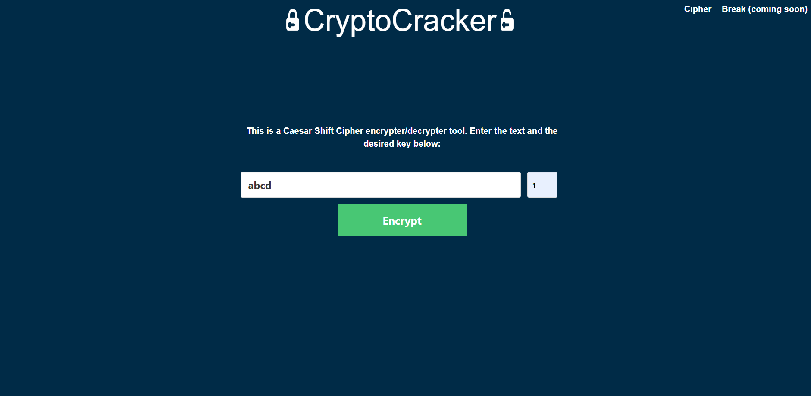
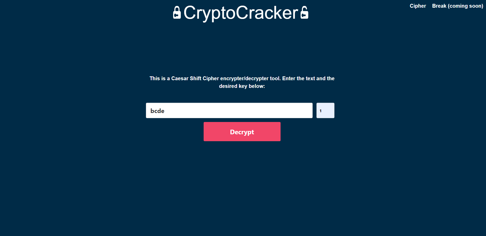

Requirements to run:
- Java 11
- Maven 3+
- Node 10+ (installed through Maven)
- Yarn 1.1+ (installed through Maven)

View the project on AWS here: http://cryptocracker.ap-southeast-2.elasticbeanstalk.com

**Functionality:**

This project allows you to encrypt as well as decrypt an entered message using a Caesar Shift cipher.

**Technical Info:**

The project uses Java (JDK 11 and SpringBoot 2.2) for backend and React and Bulma for frontend. It follows a Model View Controller architecture as well as 
having a Service tier for business logic. Maven is used for dependency management, including frontend dependencies through a plugin. The project is deployed up
on AWS using Elastic Beanstalk for demonstration purposes. The project also has some nice features, 
such as input validation and dynamic animations.

Once you have the prerequisites installed, in order to run the application locally, simply create a Maven run configuration with the parameters:
```spring-boot:run -Pprod```

**Screenshots:**

Encryption example:


Decryption example:

